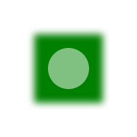
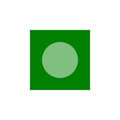
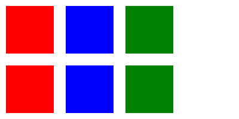
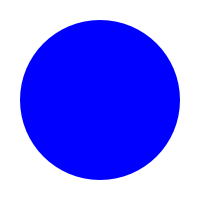
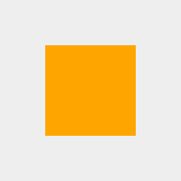
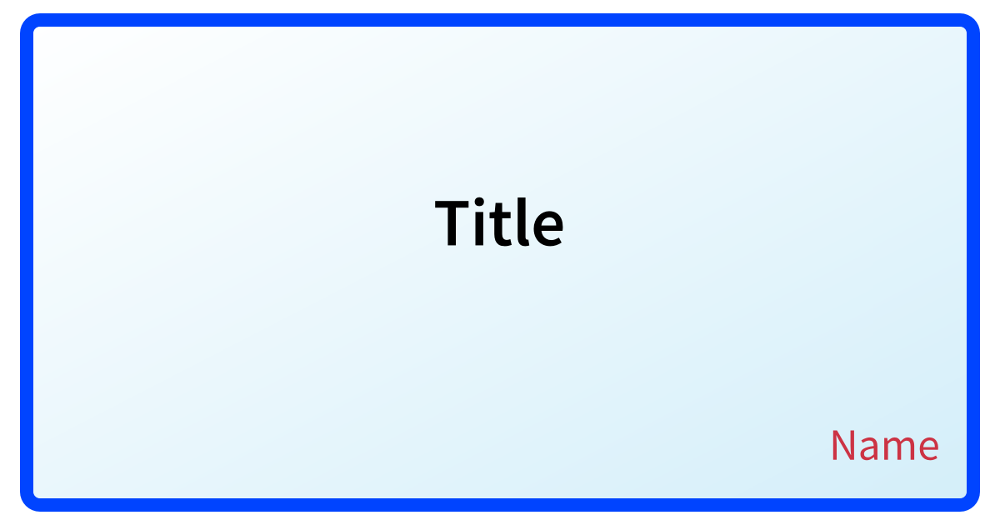

# LunaSVG (High-Precision Filter Fork)

LunaSVG is a lightweight C++ library for rendering and manipulating Scalable Vector Graphics (SVG) files. This fork features a **completely overhauled high-precision filter pipeline**.

## Key Improvements in this Fork

*   **32-bit Floating Point Pipeline**: All filter primitives (Blur, Composite, ColorMatrix, etc.) now operate using 32-bit floats, eliminating rounding errors inherent in 8-bit integer processing.
*   **Linear RGB Color Space**: Computations are performed in Linear RGB space as per the SVG specification, ensuring accurate color reproduction and smooth gradients.
*   **feDropShadow Support**: Added native support for the `feDropShadow` filter primitive.
*   **High Fidelity Rendering**: Tuned to produce results that closely match industry-standard renderers like `resvg`.

## Comparison: resvg vs. LunaSVG (This Fork)

The following table compares the output of `resvg` (standard) and `LunaSVG` with the new high-precision filter pipeline.

| Filter Example | resvg (Standard) | LunaSVG (This Fork) |
| :--- | :---: | :---: |
| **Gaussian Blur** |  |  |
| **Color Matrix** |  |  |
| **Arithmetic Composite** |  |  |
| **Drop Shadow** |  |  |
| **Complex OGP** |  |  |

## Basic Usage (C++)

```cpp
#include <lunasvg.h>

using namespace lunasvg;

int main() {
    auto document = Document::loadFromFile("input.svg");
    if(document == nullptr) return -1;

    auto bitmap = document->renderToBitmap();
    if(bitmap.isNull()) return -1;

    bitmap.writeToPng("output.png");
    return 0;
}
```

## Tools

### SVG to PNG Converter
A batch conversion tool is provided in `tools/run_convert.ts`. It uses a cross-platform wrapper to run the high-precision C++ backend.

**Execution:**
```bash
pnpm convert
```
This command converts SVG files in `images/svg` to PNG in `images/png-luna` and `images/png-resvg`.

## Testing

This project uses `vitest` and `pixelmatch` to compare rendering output against `resvg`.

**Run Tests:**
```bash
pnpm test
```
This will generate diff percentages for all sample images. Our goal is < 0.2% difference for most complex filters.

## Installation

### Using CMake

```bash
cmake -B build .
cmake --build build --config Release
```
The compiled binaries and libraries will be located in the `dist` directory.

## License

LunaSVG is licensed under the MIT License. See [LICENSE](LICENSE) for more information.
